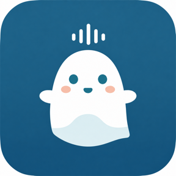

# Sotto

<p align="center">
  
</p>

macOSのメニューバーからシステム音声とマイクを録音し、停止後に日本語で文字起こしするアプリです。

- システム音声とマイクを1つの`.m4a`へ保存
- 録音せずにシステム音声とマイクの入力レベルを確認
- 文字起こしは`自分`と`システム`に分けてMarkdownへ出力
- 文字起こし中でも次の録音を開始できる
- 音声や文字起こし結果を外部へ送らない

他人の音声を録音する場合は、録音前に対象となる全員から明示的な同意を得てください。

## 環境

- macOS 26.0以上
- Appleシリコン搭載Mac（文字起こしを使う場合）
- Xcode 26.x（ソースからビルドする場合のみ）

## インストール

1. [最新のRelease](https://github.com/yhrym/Sotto/releases/latest)から`Sotto-local.zip`と`Sotto-local.zip.sha256`をダウンロード
2. Terminalでハッシュを確認

```bash
cd ~/Downloads
shasum -a 256 -c Sotto-local.zip.sha256
```

`Sotto-local.zip: OK`と出れば問題ありません。

3. ZIPを展開し、`Sotto.app`をApplicationsへ移動
4. Sottoを一度開いて警告を閉じる
5. `システム設定 > プライバシーとセキュリティ`の「このまま開く」を押す

Developer IDで署名していないため、初回だけ手順5が必要です。詳しくは[Appleの案内](https://support.apple.com/ja-jp/guide/mac-help/mh40616/mac)を参照してください。

## 権限

初回の入力チェックまたは録音開始時に次の2つを許可します。

- マイク
- 画面とシステムオーディオ録音

画面収録の一覧にSottoがない場合は、`+`を押して追加します。ファイル選択画面で`⌘ShiftG`を押し、`/Applications/`へ移動すると選択できます。

権限を変更したあとはSottoを再起動してください。画面の映像は保存せず、受け取ったフレームもすぐ破棄します。

文字起こしがONの場合、初回だけ日本語モデルの準備が入ることがあります。モデルが利用できない場合もサーバー認識には切り替えません。

## 使い方

1. メニューバーのSottoを開く
2. `録音開始`を押す
3. 録音が終わったら`録音停止`を押す

文字起こしは停止後にバックグラウンドで始まります。

保存先の初期値はこちらです。

```text
~/Music/Sotto/YYYY-MM-DD/
├── 2026-07-28_143012.m4a
└── 2026-07-28_143012.md
```

保存先、ビットレート、ログイン時の起動、マイクとシステム音声のゲインなどは設定画面から変更できます。`入力チェックを開始`を押すと、録音せずに入力レベルを確認できます。

## ソースからビルド

Apple Developer Programへの登録は不要です。

Xcodeで`Sotto.xcodeproj`を開き、TARGETSの`Sotto`から次を確認します。

1. `Signing & Capabilities`を開く
2. Signing Certificateを`Sign to Run Locally`にする
3. Schemeを`Sotto`、実行先を`My Mac`にする
4. `⌘B`でビルド

Terminalからビルドする場合はこちらです。

```bash
xcodebuild \
  -project Sotto.xcodeproj \
  -scheme Sotto \
  -configuration Debug \
  -destination 'platform=macOS' \
  -derivedDataPath "$PWD/.build/DerivedData" \
  CODE_SIGN_IDENTITY=- \
  CODE_SIGNING_REQUIRED=YES \
  build
```

ビルド結果をApplicationsへコピーします。

```bash
sudo ditto \
  .build/DerivedData/Build/Products/Debug/Sotto.app \
  /Applications/Sotto.app
```

## ネットワーク通信について

Sottoのプロセスはネットワーク通信できません。

- App Sandboxを有効にしている
- `com.apple.security.network.client`を持たない
- `com.apple.security.network.server`を持たない
- 文字起こしは`SpeechAnalyzer` / `SpeechTranscriber`のオンデバイス認識だけを使う
- 外部API、SPMパッケージ、テレメトリ、自動更新を使わない

日本語モデルが未導入の場合、AppleのSpeech frameworkがモデルを準備します。録音音声、文字起こし結果、日時、ファイル名はモデル取得要求へ渡しません。

### entitlementを確認

```bash
codesign -d --entitlements - /Applications/Sotto.app
```

出力に次があることを確認します。

```text
com.apple.security.app-sandbox
com.apple.security.device.audio-input
com.apple.security.assets.music.read-write
com.apple.security.files.bookmarks.app-scope
com.apple.security.files.user-selected.read-write
```

`com.apple.security.network.client`と`com.apple.security.network.server`がなければOKです。

### 実行中の通信を確認

まずPIDを調べます。

```bash
pgrep -x Sotto
```

録音から文字起こし完了まで、別のTerminalで確認します。

```bash
lsof -nP -a -p <PID> -i
```

何も表示されなければ、Sottoが持つネットワークソケットはありません。継続して見る場合は`nettop -p <PID>`も使えます。

ブラウザや通話アプリは普通に通信するので、確認するときはSottoのPIDを指定してください。

## 困ったとき

### 録音できない・音が入らない

- ディスクの空き容量が1GB以上あるか確認
- マイクと画面収録の権限を確認
- 設定画面の入力レベルが動くか確認
- 権限を変更した場合はSottoを再起動

### 文字起こしに失敗する

メニューに失敗理由が出ます。原因を直したあとに再実行してください。

失敗しても`.m4a`は削除しません。再実行に使う分離音声も残します。

### AirPodsなどを切り替えた

入力デバイスの変更で録音が止まった場合は、現在のファイルを閉じて`_part02`以降へ分割して再開します。

## 保存データ

- 録音とMarkdown: 設定した保存先
- 文字起こし用の分離音声: Caches
- 設定: App Sandboxのコンテナ

文字起こしに成功すると、分離音声は削除します。設定の`一時ファイルを残す`がONの場合と、文字起こしに失敗した場合は残します。

実装の詳細は[設計書](docs/DESIGN.md)にまとめています。
